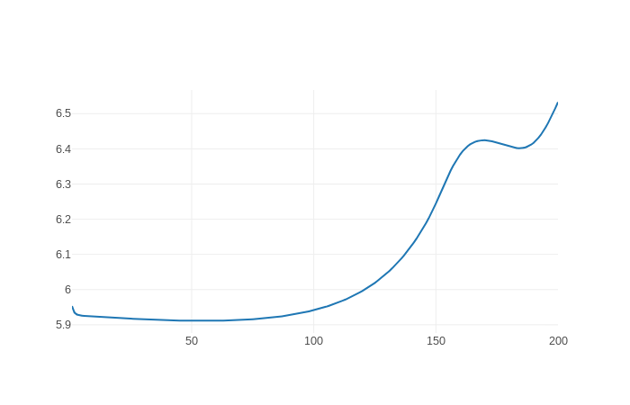

# Vivisect

## LSTM probe


## Dense probe



This library is intended as unified task-based introspection of neural model layers for Tensorflow, PyTorch, and MXNet.  Minimally, it consists of two components: 

1.  A server, which provides a REST endpoint for receiving tensors and labels which it uses for lightweight tasks that calculate a *score* associated with each tensor's performance on each task
2.  A function, `probe`, imported from the `vivisect` library, that takes a neural model and attaches callbacks to its operations for shipping tensors, along with appropriate labels, to the server, at appropriate intervals

It will support three types of *score*:

1.  Intrinsic scalar properties of tensors (e.g. mean, variance)
2.  Performance on supervised classification of labels based on tensor values (e.g. f-score using logistic regression)
3.  Unsupervised clustering based on tensor values (e.g. mutual information with a gold standard, using k-means)

and three popular deep learning frameworks, with associated model classes:

1.  Tensorflow *Session*
2.  PyTorch *Module* (including *OpenNMT*)
3.  MXNet *Symbol* and *Block* (including *Sockeye*)

Libraries built on these frameworks should be able to use *vivisect* without modification if they subclass appropriately.

## Quick setup

Clone this repository:

```
git clone https://github.com/hltcoe/vivisect.git
```

and follow instructions for either Docker or non-Docker:

### Docker

If you have Docker and docker-compose installed, and the former running, you can pull the pre-built image with `docker pull hltcoe/vivisect`, or build it from scratch with `scripts/build_docker.sh`.  Either way, start the servers with:

```
docker-compose up -d
```

A random port will be forwarded for the *aggregator* server, which client code talks to, and the *frontend*, which can be browsed to:

```
docker-compose ps
        Name                       Command               State            Ports         
----------------------------------------------------------------------------------------
vivisect_aggregator_1   python36 -m vivisect.serve ...   Up      0.0.0.0:32785->8080/tcp
vivisect_evaluator_1    python36 -m vivisect.serve ...   Up                             
vivisect_frontend_1     python36 -m vivisect.serve ...   Up      0.0.0.0:32784->8080/tcp
```

Based on this output, let's define `AGG_PORT=32785` and `FRONT_PORT=32784`.

You can run the built-in tests with:

```
docker-compose exec aggregator run_mlps.py --epochs 10
docker-compose exec aggregator run_rnns.py --epochs 10
```

View the results of the tests by browsing to `localhost:FRONT_PORT`.  You can use the setup in client code, outside of Docker, by calling Vivisect methods with `localhost` as the host and `AGG_PORT` as the port.

### Non-Docker (better for developers, etc)

Install Vivisect and its dependencies:

```python
pip install . --user --pre --process-dependency-links
```

Vivisect is composed of three servers that need to be running simultaneously, so e.g. run these commands in separate terminals on a single machine.  First, the `aggregator`, with whom client code directly communicates:

```bash
FLASK_APP="src/servers/aggregator.py:create_server('localhost', 8081)" flask run --port 8082 --reload
```

This server receives and accumulates layers and metadata, and when it determines a full time-step (usually, one training iteration) has completed for a model, combines and sends them to the `evaluator`:

```bash
FLASK_APP="src/servers/evaluator.py:create_server('localhost', 8080)" flask run --port 8081 --reload
```

This server receives an epoch's-worth of layers at a time, i.e. enough to calculate some value for model `M`'s operation `O` at iteration `I`.  It calculates a scalar value, and sends it along to the `frontend`:

```bash
FLASK_APP="src/servers/frontend.py:create_server()" flask run --port 8080 --reload
```

This is the server that collects and presents results, i.e. you can browse to `localhost:8080`.  Right now, the top-level page lists the models, the second level lists the metrics for a given model, and the third level plots the metric for each operation as a function of time.

In another terminal, run one of the tests:

```bash
run_mlps.py --host localhost --port 8082 --epochs 5
```

You should see output on each of the server terminals as the example models train and pass information along.  After the script returns, you can browse to the interface to see the plots.

## Using in your code

Minimally, it takes two additional lines of code to use *vivisect* for an existing model:

```python
from vivisect.pytorch import probe

model = <DEFINE YOUR MODEL LIKE NORMAL>

probe(model, "localhost", 8080)

<TRAIN YOUR MODEL LIKE NORMAL>
```

This will walk through your model and attach monitors to the forward calls of every operation that ship off their input, output, and parameter tensors to the `aggregator` server every time they're invoked.

For a non-trivial model, monitoring every forward call of every operation creates significant overhead, so `probe` takes two optional arguments: `what` and `when`.  These are binary functions that determine `what` operations to monitor, and `when` to monitor them.  They have the same signature, which is pretty self-explanatory:

```
(model, operation) -> Bool
```

Regardless of the underlying framework being used, models and operations always have a special dictionary value called `_vivisect`:

```python
>>> print(model._vivisect)
{'mode' : 'train', 'iteration' : 3 ... }
```

so `what` and `when` should generally make decisions based on values from these dictionaries.  The `what` decisions are made once when `probe` is called on the model, while `when` is called many times as the model is run, so the latter in particular should be as fast as possible.

In addition to being used in these functions, the `_vivisect` dictionaries are serialized and sent along with the tensors to the server.  Managing these dictionaries and how they change as the model runs is done in user space.  At a minimum, the model should have `model._vivisect["mode"]` set to an appropriate value like "train", "dev", "test", and `model._vivisect["iteration"]` to the current training iteration (if you want to track how metrics co-evolve).  See e.g. the `train` method in `vivisect.pytorch` for an example.

## Components

When a monitored (according to the `which` callback passed to `probe`) operation's forward pass is invoked, and the boolean `when` callback returns `True`, the client sends a JSON object to the Vivisect servers with the format:

```
{"metadata" : DICTIONARY,
 "inputs" : TENSOR_LIST,
 "outputs" : TENSOR_LIST,
 "parameters" : TENSOR_LIST
 }
```

Each tensor is simply a nested list of numbers, with the first dimension always corresponds to batch.  For example, 

```
[
 [[1, 2, 3], 
  [2, 3, 4]
 ],
 [[[1, 2], 
   [2, 3]],
  [[3, 4], 
   [4, 5]],
 ]
]
``` 

corresponds to 1D and 2D tensors produced from a batch of size 2.  Various information is stuffed into the `metadata` field: anything you place in the `_vivisect` attributes of a model or its operators.  Currently Vivisect automatically populates `op_name` and expects a numeric field `iteration` and string `model_name`, and in the future may standardize additional fields.  These JSON packets, containing tensor lists and metadata, are what client code emits.

### Aggregator

The *aggregator*'s sole purpose is to receive `batch_packets`, collect them until there is a coherent set, combine them intelligently, and send them along as `eval_packets`.

The user controls what "coherent set" means by modifying the value of `model._vivisect["batch_key"]` (call this the `batch_key`).  Packets are grouped by all other key-value pairs in the `_vivisect` attribute (call this the `op_key`).  Every time a new `batch_key` is seen for a given `op_key`, the `op_key`'s current set of packets is combined, sent on, and cleared.  A common approach, for example, is to set `model._vivisect["batch_key"] = {"iteration" : 1}`, and every training epoch do `model._vivisect["batch_key"]["iteration"] += 1`, while `model._vivisect`'s `model_name` and `op_name` constitute the `op_key`, thus grouping batch-packets by iteration.

The other behavior to consider is how `batch_packets` are combined into `eval_packets`.  They have the identical structure, where the `eval_packet` metadata field has the key-value pairs that have the same value across all of the `batch_packets`, and the tensors no longer have the initial batch dimension, as they have been concatenated.

A final hiccup is, for the final batch, the *aggregator* will never see the "next" `batch_key`, so the client code should call `flush(host, port, model)` at the very end to instruct the server to consider the final batch complete.

### Evaluator

The *evaluator* receives `eval_packet`s, computes arbitrary metrics based on them, and sends the metric values along.  Each metric function has the same simple signature:

```
def my_metric(eval_packet) -> float
```

### Frontend

The *frontend* receives `metric_packet`s, which are very lightweight since they just contain metadata and the metric value.  Typically, this server is only serving `GET` requests, as web clients browse plots of the metric values.  It also accepts `POST` commands that remove collected metric values.
