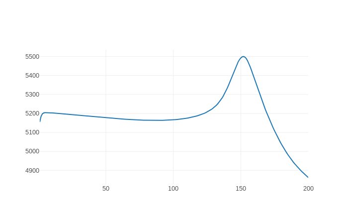

# Vivisect

## LSTM probe



## Dense probe


This library is intended as unified task-based introspection of neural model layers for Tensorflow, PyTorch, and MXNet.  Minimally, it consists of two components: 

1.  A server, which provides a REST endpoint for receiving tensors and labels which it uses for lightweight tasks that calculate a *score* associated with each tensor's performance on each task
2.  A function, `probe`, imported from the `vivisect` library, that takes a neural model and attaches callbacks to its operations for shipping tensors, along with appropriate labels, to the server, at appropriate intervals

It will support three types of *score*:

1.  Intrinsic scalar properties of tensors (e.g. mean, variance)
2.  Performance on supervised classification of labels based on tensor values (e.g. f-score using logistic regression)
3.  Unsupervised clustering based on tensor values (e.g. mutual information with a gold standard, using k-means)

and three popular deep learning frameworks, with associated model classes:

1.  Tensorflow *Session*
2.  PyTorch *Module* (including *OpenNMT*)
3.  MXNet *Symbol* and *Block* (including *Sockeye*)

Libraries built on these frameworks should be able to use *vivisect* without modification if they subclass appropriately.

## Quick setup

Install the library and the supported frameworks:

```python
pip install . --user --pre --process-dependency-links
```

Vivisect is composed of three servers that need to be running simultaneously, so e.g. run these commands in separate terminals on a single machine.  First, the `aggregator`, with whom client code directly communicates:

```bash
python scripts/run_aggregator.py --host localhost --port 8082
```

This server receives and accumulates layers and metadata, and when it determines a full time-step (usually, one training iteration) has completed for a model, combines and sends them to the `evaluator`:

```bash
python scripts/run_evaluator.py --host localhost --port 8081
```

This server receives an epoch's-worth of layers at a time, i.e. enough to calculate some value for model `M`'s operation `O` at iteration `I`.  It calculates a scalar value, and sends it along to the `frontend`:

```bash
python scripts/run_frontend.py --host localhost --port 8080 [--database FILE]
```

This is the server that collects and presents results, i.e. you can browse to `localhost:8080`.  Right now, the top-level page lists the models, the second level lists the metrics for a given model, and the third level plots the metric for each operation as a function of time.

## Testing

In another terminal, run one of the tests:

```bash
python scripts/run_examples.py --host localhost --port 8082 --epochs 5
```

You should see output on each of the server terminals as the example models train and pass information along.  After the script returns, you can browse to the interface to see the plots.

## Using in your code

Minimally, it takes two additional lines of code to use *vivisect* for an existing model:

```python
from vivisect.pytorch import probe

model = <DEFINE YOUR MODEL LIKE NORMAL>

probe(model, "localhost", 8080)

<TRAIN YOUR MODEL LIKE NORMAL>
```

This will walk through your model and attach monitors to the forward calls of every operation that ship off their input, output, and parameter tensors to the `aggregator` server every time they're invoked.

For a non-trivial model, monitoring every forward call of every operation creates significant overhead, so `probe` takes two optional arguments: `what` and `when`.  These are binary functions that determine `what` operations to monitor, and `when` to monitor them.  They have the same signature, which is pretty self-explanatory:

```
(model, operation) -> Bool
```

Regardless of the underlying framework being used, models and operations always have a special dictionary value called `_vivisect`:

```python
>>> print(model._vivisect)
{'mode' : 'train', 'iteration' : 3 ... }
```

so `what` and `when` should generally make decisions based on values from these dictionaries.  The `what` decisions are made once when `probe` is called on the model, while `when` is called many times as the model is run, so the latter in particular should be as fast as possible.

In addition to being used in these functions, the `_vivisect` dictionaries are serialized and sent along with the tensors to the server.  Managing these dictionaries and how they change as the model runs is done in user space.  At a minimum, the model should have `model._vivisect["mode"]` set to an appropriate value like "train", "dev", "test", and `model._vivisect["iteration"]` to the current training iteration (if you want to track how metrics co-evolve).  See e.g. the `train` method in `vivisect.pytorch` for an example.
